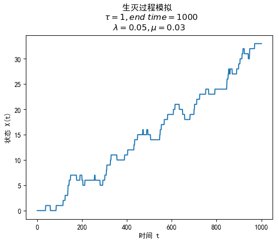
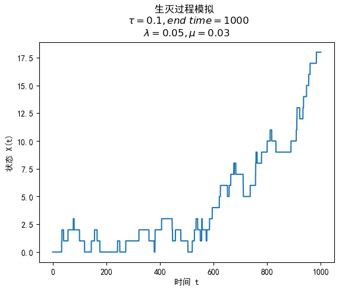
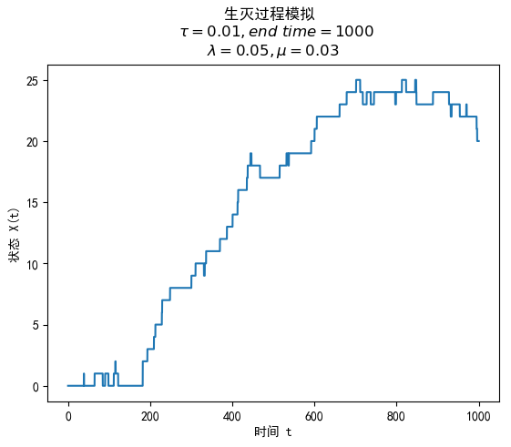
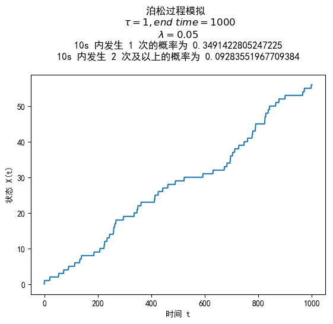
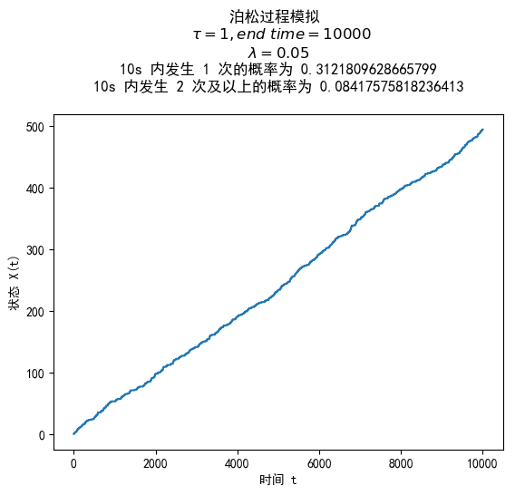
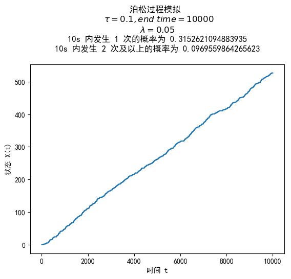

# 实验四 - 泊松过程

|学号|姓名|日期|
|:--:|:--:|:--:|
|1160300625|李一鸣|2018 年 11 月 9 日|

## 连续时间马尔科夫链

### 定义

随机过程 $\{X(t), t \ge 0\}$ 的状态空间为 $I = \{i_0, i_1, ..., i_n, ... | n \ge 0\}$，若对任意的 $0 < t_1 < t_2 < ... < t_n < ...$，有

$$
\begin{aligned}
  & P\{X_{(t_{n+1})} = i_{n+1}|X_{(t_{1})} = i_{1}, X_{(t_{2})} = i_{2}, ..., X_{(t_{n})} = i_{n}\} \\
  = & P\{X_{(t_{n+1})} = i_{n+1}|X_{(t_{n})} = i_{n}\}
\end{aligned}

\tag{1}
$$

直观上理解为：在 $t_{n+1}$ 时刻的状态只受 $t_{n}$ 时刻状态的影响。

与离散时间马尔科夫链相比，多了一个时间的概念，之前用 $X(n)$ 表示随机过程，其中的 $n$ 是离散的；而这里 $X(t)$ 表示随机过程，其中的 $t$ 是连续的。

注意：在连续时间马尔科夫链中，时间是连续的，状态是离散的。

具有状态 $0, 1, ...$ 的连续时间齐次马尔科夫链的一步转移概率矩阵为：

### 转移概率

在 $s$ 时刻处于状态 $i$，经过时间 $t$ 后转移到状态 $j$ 的概率为：

$$
p_{ij}(s, t) = P\{X(s+t) = j|X(s) = i\}

\tag{2}
$$

定义齐次连续时间马尔科夫链，其『齐次转移概率』满足：

$$
p_{ij}(s, t) = p_{ij}(t)

\tag{2}
$$

也就是说不管起始时间 $s$ 是多少，转移概率只与时间间隔 $t$ 有关。

在后文中，我们只考虑齐次连续时间马尔科夫链。

转移概率矩阵为：

$$
P(t) = \begin{pmatrix}
  p_{11}(t) & p_{12}(t) & \cdots & p_{1n}(t) & \cdots \\
  p_{21}(t) & p_{22}(t) & \cdots & p_{2n}(t) & \cdots \\
  \vdots & \vdots & \vdots & \vdots & \vdots \\
\end{pmatrix}

\tag{3}
$$

转移速率矩阵为 $Q$，有：

$$
\begin{aligned}
P'(t) &= \lim_{\Delta t \to 0} \frac{P(t + \Delta t) - P(t)}{\Delta t} \\
&= \lim_{\Delta t \to 0} \frac{P(t)[P(\Delta t) - E]}{\Delta t} \\
&= P(t)Q
\end{aligned}

\tag{4}
$$

其中：

$$
Q = \begin{pmatrix}
  -q_{11} & q_{12} & \cdots & q_{1n} & \cdots \\
  q_{21} & -q_{22} & \cdots & q_{2n} & \cdots \\
  \vdots & \vdots & \vdots & \vdots & \vdots \\
\end{pmatrix}

\tag{5}
$$

$$
\begin{aligned}
  & \lim_{\Delta t\to 0}\frac{1-p_{ii}(\Delta t)}{\Delta t} = \lambda_i = q_{ii} \\
  & \lim_{\Delta t \to 0} \frac{p_{ij}(\Delta t)}{\Delta t} = q_{ij}, j \neq i
\end{aligned}

\tag{6}
$$

+ $q_{ij}$ 称为齐次连续时间马尔科夫链从状态 $i$ 到状态 $j$ 的转移速率。
+ $q_{ii}$ 称为齐次连续时间马尔科夫链从状态 $i$ 离开状态 $i$ 的转移速率。
+ 显然有 $\displaystyle{q_{ii} = \sum_{j\neq i} q_{ij}}$

## 生灭过程

在前面齐次连续时间马尔科夫链的基础上，如果加上这样的条件：

$$
\forall |i-j| > 1, q_{ij} = 0

\tag{7}
$$

则称齐次连续时间马尔科夫链为生灭过程。

直观上理解为：它从状态 $i$ 只能转移到状态 $i-1$ 或 $i+1$。

+ 生长率 $\lambda_i = q_{i, i+1}, i \ge 0$，直观上理解为群体数量加 $1$ 的概率
+ 死亡率 $\mu_i = q_{i, i-1}, i \ge 1$，直观上理解为群体数量减 $1$ 的概率-

显然有：

$$
v_i = q_{ii} = \sum_{j\neq i} q_{ij} = \lambda_i + \mu_i

\tag{8}
$$

从状态 $i$ 转移到状态 $i+1$ 的概率为

$$
P(i \to i+1) = \frac{\lambda_i}{\lambda_i+\mu_i} = 1 - \frac{\mu_i}{\lambda_i+\mu_i} = 1 - P(i+1 \to i)

\tag{9}
$$

在一小段时间 $\tau$ 内，转移概率矩阵为：

$$
\begin{aligned}
  P(\tau) 
  &= \begin{pmatrix}
  p_{11}(\tau) & p_{12}(\tau) & \cdots & p_{1n}(\tau) & \cdots \\
  p_{21}(\tau) & p_{22}(\tau) & \cdots & p_{2n}(\tau) & \cdots \\
  \vdots & \vdots & \vdots & \vdots & \vdots \\
\end{pmatrix} \\
  &= \begin{pmatrix}
    1 - \lambda_1\tau + o(\tau) & \lambda_1\tau+o(\tau) & o(\tau) & \cdots & o(\tau) & \cdots \\
    \mu_2\tau & 1 - (\lambda_2+\mu_2)\tau + o(\tau) & \lambda_2\tau & \cdots & o(\tau) & \cdots \\
    o(\tau) & \mu_3\tau & 1 - (\lambda_3+\mu_3)\tau + o(\tau) & \cdots & o(\tau) & \cdots \\
    \vdots & \vdots & \vdots & \vdots & \vdots & \vdots\\
  \end{pmatrix}
\end{aligned}

\tag{10}
$$

## 泊松过程

### 定义 1

计数过程 $\{N(t), t \ge 0 \}$ 称为具有参数 $\lambda(\lambda > 0)$ 的泊松过程，如果：

1. $N(0) = 0$
2. 过程有独立增量
3. 在任一长度为 $t$ 的区间中事件的个数服从均值为 $\lambda t$ 的泊松分布。即对一切 $s, t \ge 0$
    $$
    P(N(t) = n) = e^{-\lambda t}\frac{\lambda t^n}{n!}, n = 0, 1, ...
    $$

### 定义 2

计数过程 $\{N(t), t \ge 0 \}$ 称为具有参数 $\lambda(\lambda > 0)$ 的泊松过程，如果：

1. $N(0) = 0$
2. 过程有平稳与独立增量
3. 在 $\Delta t$ 充分小时，在 $(t, t+\Delta t)$ 内事件发生一次的概率为 $\lambda \Delta t + o(\Delta t)$，即 $P(N(t+\Delta t)-N(t) = 1) = \lambda \Delta t+ o(\Delta t)$
4. 在 $\Delta t$ 充分小时，在 $(t, t+\Delta t)$ 内事件发生两次或以上的概率为 $o(\Delta t)$，即 $P(N(t+\Delta t)-N(t) \ge 2) = o(\Delta t)$

定义 1 和定义 2 是等价的，证明略去。

## 实验结果

### 生灭过程模拟

生成一个 $X(0) = 0$，且 $\forall i \ge 0, \lambda_i = 0.05, \mu_i = 0.03$ 的生灭过程，画出 $X(t)$ 随 $t$ 变化的曲线。其中 $t \in [0, 1000]$。

根据 $(10)$ 式得到的转移矩阵，改变 $\tau$ 的值，分别进行实验，作出图像。

#### $\tau = 1$

从图中可以看出最后状态达到了 7 左右。

#### $\tau = 0.1$

从图中可以看出最后状态达到了 17 左右。与之前 $\tau = 1$ 的差别很大，应该是之前 $\tau$ 值不够小的原因。

#### $\tau = 0.01$

从图中可以看出最后状态达到了 20 左右。

### 泊松过程模拟

1. 生成一个 $X(0) = 0, \lambda = 0.05$ 的泊松过程，画出 $X(t)$ 随 $t$ 变化曲线。其中 $t \in [0, 1000]$。

    相比于之前的生灭过程，选择好 $\tau$ 之后，每经过过 $\tau$ 时间间隔，状态以 $\lambda \tau$ 的概率加一，以 $1 - \lambda \tau$ 的概率不变。

2. 统计 $t \in [0, 10000]$ 时间内 $\Delta t = 10$ 的区间内事件发生一次的概率
   
   增大时间区间长度到 $[0, 100000]$，根据计算出的 $X(t)$ 计算在 $10s$ 内事件恰好发生一次的次数，除以总的时间点数，即可以算出 $\Delta t = 10$ 的区间内事件发生一次的概率

3. 统计 $t \in [0, 10000]$ 时间内 $\Delta t = 10$ 的区间内事件发生 2 次及以上的概率

    根据计算出的 $X(t)$ 计算在 $10s$ 内事件发生 2 次及以上的次数，除以总的时间点数，即可以算出 $\Delta t = 10$ 的区间内事件发生一次的概率

#### $t \in [0, 1000], \tau = 1$

#### $t \in [0, 10000], \tau = 1$

#### $t \in [0, 10000], \tau = 0.1$

